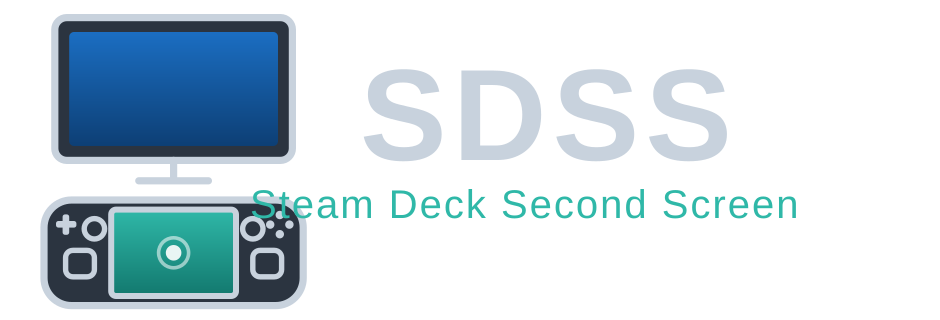

<p align="center">
  
</p>

<p align="center">
  Use a <b>Steam Deck as the second screen</b> for DS / 3DS / Wii U emulation running on a
  <b>Steam Machine</b> (SteamOS, gamescope session).
</p>

The TV shows the main screen. The Deck shows the DS bottom screen / 3DS bottom screen /
Wii U GamePad — and its touchscreen acts as the stylus.

```
Steam Machine (SteamOS / gamescope session)
└── sdss run -- <emulator>
    └── nested sway compositor
        ├── output X11-1       → per-game Xwayland     → TV        (main screen)
        │   └── WL-1 fallback  → gamescope Wayland     → TV        (native/off-Steam)
        └── output HEADLESS-1  → captured by Sunshine  → Moonlight (second screen)
                                                           ↑ touch ↓
                                               sdss-inputd (stylus injection)
```

## Why it works this way

gamescope is a single-window micro-compositor. It cannot show or stream two toplevel
windows of one emulator independently, and a single process cannot split its windows across
two compositors. So SDSS runs the emulator inside a **nested compositor with two outputs** —
one visible on the TV, one headless and streamed.

Rejected alternatives:

| Approach | Why not |
| --- | --- |
| Apollo virtual display | Windows-only |
| Steam Remote Play | Streams only the focused game window |
| Two gamescope instances | One process cannot split windows across compositors |
| RetroArch DS cores | Both screens share one framebuffer; no second window exists |

## Supported emulators

| System | Emulator | Second-screen mechanism | Verified |
| --- | --- | --- | --- |
| Wii U | Cemu (AppImage) | `settings.xml` → `<open_pad>true</open_pad>`, window `GamePad View` | yes (needs Xwayland) |
| 3DS | Azahar (AppImage) | `qt-config.ini` → `layout_option=4` + `secondary_display_layout=2`, window `… \| Secondary Window` | yes |
| DS | melonDS (Flatpak) | `melonDS.toml` → `Instance0.Window1.ScreenSizing` | no |

RetroArch DS cores are **not** supported — they render both screens into one framebuffer.

## Status

Early development. See [docs/PLAN.md](docs/PLAN.md) for the phased plan and
[docs/hardware-recon.md](docs/hardware-recon.md) for verified facts about the target hardware.

| Phase | State |
| --- | --- |
| P0 spikes | dual output, capture, Cemu/Azahar second windows, and an end-to-end stream to the Deck all proven; see [docs/spikes](docs/spikes) |
| P1 `sdss run` | implemented; every piece verified individually |
| P2 emulator profiles | Cemu and Azahar verified; melonDS open |
| P3 touch bridge | `sdss-inputd` implemented; streams verified end to end |
| P4 Decky plugin | implemented — toggles second screen mode and restores configs |
| P5 Deck helper | `deck/install.sh` + `deck/sdss-connect.sh` |
| P6 packaging | `install.sh` covers both endpoints from one `.desktop` launcher |

## Repo layout

```
host/       Python package `sdss` — launch wrapper, compositor + Sunshine config, CLI
plugin/     Decky plugin (Steam Machine UI)
deck/       Steam Deck side helper (Moonlight auto-connect)
runtime/    Build recipes for the bundled sway/wlroots compositor
packaging/  Host installer, uninstaller, udev rule, desktop launcher
docs/       Plan, architecture, spike results
assets/     Logo and other artwork
```

## Install

Copy this repository to the device (or clone it), then either double-click
**Install SDSS** in the file manager or run:

```bash
./install.sh
```

The installer detects whether it is on a Steam Machine (`Fremont`) or a Steam Deck
(`Jupiter` / `Galileo`) and asks for confirmation, then remembers the answer. It copies
itself to `~/.local/share/sdss/release` and adds an **Install or Update SDSS** launcher
that re-runs the endpoint setup from there.

| | Steam Machine (host) | Steam Deck (client) |
| --- | --- | --- |
| Flatpaks | Sunshine | Moonlight |
| Binaries | `~/.local/bin/sdss` | `~/.local/bin/sdss-connect` |
| System changes | one udev rule (asks for sudo once) | none |
| Extras | compositor image, Decky plugin | Steam shortcut + library artwork + controller template |

Nothing is written outside `$HOME` except two files under `/etc` — the udev rule and its
SteamOS atomic-update keep-list entry, which is what makes the rule survive OS updates.

Non-interactive:

```bash
./install.sh --role steam-machine
./install.sh --role steam-deck --host 10.0.0.5
```

### Updating

The desktop launcher runs the *installed* copy, so on its own it only re-runs the endpoint
setup — it has no newer code to copy. To pick up a new version, point it at a fresh
checkout:

```bash
./install.sh                       # from the new checkout, or
~/.local/share/sdss/release/install.sh --source /path/to/new/checkout
```

The release directory is swapped in atomically; if the swap fails the previous release is
put back.

### Uninstalling

```bash
~/.local/share/sdss/release/packaging/uninstall.sh
```

This restores every emulator config SDSS patched *before* removing anything, then deletes
the release, the `sdss` shim, the launcher, the Decky plugin and the compositor image. On a
Deck install it also removes `sdss-connect`, the SDSS Steam shortcut, and the SDSS
controller template. The udev rule is left in place (it is inert without SDSS); the command
to remove it is printed by `uninstall.sh --help`.

Development on the host uses the same package directly:

```bash
PYTHONPATH=host/src python3 -m sdss.cli doctor
cd host && python3 -m unittest discover -s tests
```

### Decky plugin

The plugin toggles second screen mode (globally and per emulator). Enabling snapshots and
applies only SDSS-managed emulator keys; disabling selectively restores those keys while
preserving unrelated settings. The plugin shells out to `sdss`, so config edits always go
through the patch journal.

SteamOS has no node, so `plugin/dist/index.js` is committed prebuilt. After changing the
frontend:

```bash
cd plugin && npm install && npm run build
```

The bundle is only rebuilt by `plugin/install.sh` when `dist/index.js` is missing, so a
committed bundle always wins on SteamOS. Force a rebuild on a machine with node:

```bash
SDSS_REBUILD_PLUGIN=1 plugin/install.sh
```

## Deck controller template (required for 1:1 touch)

`deck/install.sh` installs a Steam Input template named **SDSS - Second Screen**. It is
derived on-device from Steam's own `Gamepad with Joystick Trackpad` template plus one
always-on `Touchscreen Native Support` command, so it never goes stale when Valve changes
the controller schema.

Select it in Game Mode: `Second Screen` -> Controller Settings -> current layout ->
Templates -> `SDSS - Second Screen`.

Without this, Steam Input can consume touchscreen events before Moonlight sees them.
With it, touch maps 1:1 to the streamed second screen.

For touch validation, prefer a ROM that needs frequent bottom-screen taps (for example,
`The Legend of Zelda: A Link Between Worlds`) rather than one that can progress mostly
without touch.

## Constraints

- The SteamOS root filesystem stays **read-only**. Everything installs under `$HOME`
  (Flatpaks + a bundled compositor runtime).
- Emulator config ownership follows the Decky toggle. Managed keys restore selectively on
  disable; checksum-verified full backups remain available for recovery.
