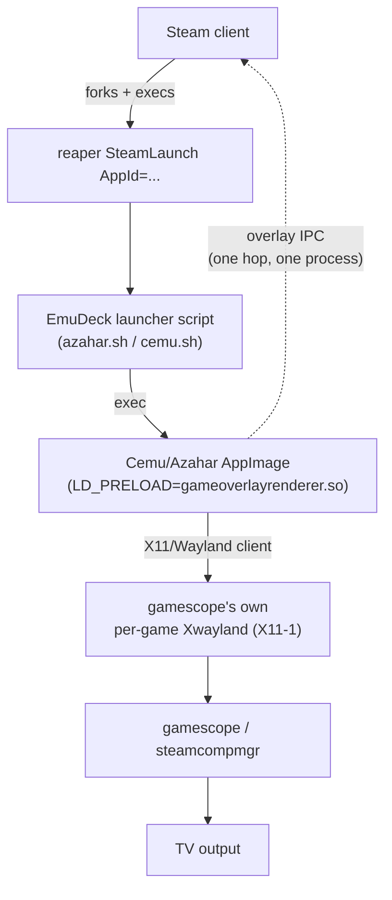
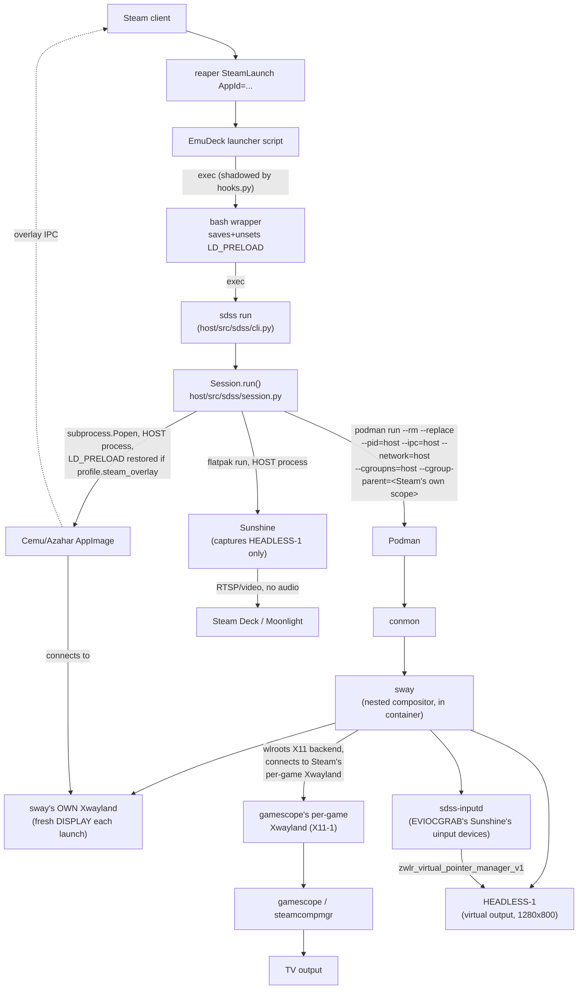

# SDSS — what it actually does, and why it destabilizes Steam

This document exists because incremental fixes (gamescope WSI opt-out, overlay-preload
isolation for helpers, Azahar's OpenGL override, stale-process reaping, config-journal
redesign — all in [docs/hardware-test-report.md](hardware-test-report.md)) each closed a
real, verified leak source, and Steam still destabilizes. That pattern — a new proximate
cause every time, the same abort every time — means the risk lives in the *shape* of the
architecture, not in any single line of code. This document draws the shape, contrasts it
with a vanilla (non-SDSS) launch, and lays out the hardware evidence for what triggers the
abort. [docs/redesign-plan.md](redesign-plan.md) proposes what to do about it.

> **Status update, 2026-08-19**: the "Phase 0" hardening from
> [docs/redesign-plan.md](redesign-plan.md#phase-0--immediate-low-risk-hardening-do-this-regardless-of-phase-12-outcome)
> (graceful compositor teardown, dropping the unexplained `--ipc=host`) has been implemented
> and validated on hardware — a 5-cycle alternating Cemu/Azahar test covering the exact
> transitions documented in §3.3 below as reliably fatal completed with zero crashes and flat
> Steam memory. The evidence and hypothesis below describe the mechanism that was fixed and
> remain accurate as a historical/diagnostic record; they no longer describe the live
> behavior of the current codebase. See the redesign plan's status update for what's still
> outstanding (goal 3's process-count gap, not a crash risk).
>
> **Further update, same day, later**: true to this document's own opening observation — "a
> new proximate cause every time, the same abort every time" — the crash recurred after a
> 48-cycle acceptance test had declared Phase 0 sufficient. The new proximate cause this time:
> sway, Xwayland and sdss_inputd crashing with SIGBUS during a *different* session's teardown,
> apparently triggered when Azahar's SIGTERM handling occasionally (not reliably) reacts within
> milliseconds instead of ignoring the signal, crashing instead of exiting and corrupting
> shared GPU state the compositor stack then also crashes on. Fixed by sending the emulator
> SIGKILL immediately rather than SIGTERM, removing its chance to run that signal handling at
> all. Verified on hardware over 23 more cycles: zero coredumps, zero SIGBUS/SIGABRT. Full
> account in [docs/hardware-test-report.md](hardware-test-report.md). Given the pattern this
> document itself names, treat this as the current best evidence, not a final closure.
>
> **Yet another update, same day, later still**: right on cue, the 23-cycle verdict was also
> premature. A fresh crash reproduced (Azahar, then Cemu) with the emulator already receiving
> immediate SIGKILL, which ruled out that fix's own theory. The actual trigger was one level
> up the stack: `runtime.remove_container()`'s own graceful `podman kill --signal TERM` against
> the *compositor* container occasionally (not reliably) crashes sway with SIGBUS itself,
> producing the identical triple-coredump signature previously blamed on the emulator. Fixed by
> removing the graceful TERM attempt entirely — the container now goes straight to
> `--signal KILL`. Verified on hardware over 30 more cycles: zero coredumps, zero SIGBUS. Full
> account in [docs/hardware-test-report.md](hardware-test-report.md#the-emulator-sigkill-fix-was-also-insufficient-the-real-trigger-was-the-compositors-own-graceful-term-2026-08-19-later-still).
> Validation then moved from scripted teardown signals to real Steam-overlay "Exit Game"
> navigation, at the user's request, on the reasoning that a script might not exercise the same
> path a real player does — see that section for where that testing stood when the Steam
> Machine itself stopped responding to the network. As ever: current best evidence, not a
> final closure.
>
> **Continued, 2026-08-21, after the network outage**: real Steam-overlay "Exit Game" testing
> (Azahar ~15-30s, exit via the overlay, then Cemu) resumed and the abort reproduced on
> essentially every cycle — a much higher rate than any prior occurrence in this document,
> and with sway/Xwayland/sdss_inputd's SIGBUS gone for good this time (confirmed absent
> across every incident this round). Four independent, verified noise-reduction fixes landed
> first (compositor killed before the emulator rather than after, closing the window where a
> live sway could still fault on the emulator's stale GPU buffer; Sunshine's system tray and
> `min_log_level` quieted; libva's own independent `LIBVA_MESSAGING_LEVEL` logging quieted) —
> none stopped the recurrence, though the first closed a real, separate SIGBUS bug and the
> latter three measurably cut the log volume `srt-logger` has to relay. That negative result,
> plus rereading this document's own §3.4 hypothesis against the *current* code, surfaced the
> actual regression: `reap_orphaned_helpers()` — added after this document's last update,
> to fix a *third*, separate SIGBUS mechanism (sway/Xwayland/sdss_inputd faulting when
> conmon/fuse-overlayfs disappear while they are still demand-paging code from the
> container's rootfs) — kills sway directly with an unconditional, immediate SIGKILL. Since
> `remove_container()` calls it before any `podman kill` even runs, sway has had **zero**
> opportunity for a graceful X11 disconnect since that fix landed, which is exactly the
> "ungraceful teardown" condition §3.4 names as the likely trigger — silently reintroduced by
> a fix for an unrelated crash. Fixed by giving sway/Xwayland/sdss_inputd a bounded SIGTERM
> before `reap_orphaned_helpers()`'s existing SIGKILL, now that the kill order (compositor
> before emulator, from this update's first fix above) means that SIGTERM runs while the
> emulator's GPU context is still alive — the precondition the original graceful-TERM SIGBUS
> (the "later still" update above) was never actually tested under, since at the time the
> emulator always died first. Full account, including why this is a bet and not a proven
> fix, in [docs/hardware-test-report.md](hardware-test-report.md#reap_orphaned_helpers-was-silently-back-to-ungraceful-teardown-a-bounded-sigterm-before-sigkill-2026-08-21).
> **Unverified on hardware as of this writing** — deployed, but the next real reproduction
> attempt is what will actually test it.

Read this alongside [docs/PLAN.md](PLAN.md) (the original design rationale) and
[docs/hardware-recon.md](hardware-recon.md) (verified hardware facts). Nothing here
contradicts either — it assembles what they already established into one picture, plus
fresh evidence gathered on 2026-08-19.

## 1. Vanilla Steam Game Mode launch (the baseline)

This is what happens when Cemu or Azahar is launched **without** SDSS — the behavior the
user has confirmed works flawlessly, including Azahar on Vulkan with the overlay active:



One process tree, one compositor (gamescope itself), one X11/Wayland connection between the
game and the display server Steam already manages. The overlay library has exactly one
thing to talk to. Steam has shipped this path for years across a huge population of games;
it is not the fragile part of anything here.

## 2. The SDSS launch (current architecture)



Every one of those extra boxes is a real process SDSS starts **fresh, every single Steam
launch**, because [hooks.py](/Users/timo/Projects/SDSS/host/src/sdss/hooks.py) shadows the
emulator's own launcher path (`~/Applications/Cemu.AppImage`, etc. — see
[profiles.py](/Users/timo/Projects/SDSS/host/src/sdss/profiles.py:162)) with a wrapper that
execs `sdss run` on every launch, with no persistent SDSS-owned process surviving between
launches. Closing the game and reopening it — Cemu, Cemu again, or Cemu then Azahar — tears
every one of these down and rebuilds all of them from nothing.

### 2.1 What SDSS adds, enumerated

| # | Component | Where it runs | Started by | Torn down by |
|---|---|---|---|---|
| 1 | Shadow wrapper script | Replaces the real AppImage/Flatpak export path | `sdss enable` / self-heals on every `sdss status` ([hooks.py](/Users/timo/Projects/SDSS/host/src/sdss/hooks.py:114)) | `sdss disable` |
| 2 | `sdss run` (Python) | Host process, child of the wrapper | The wrapper, every launch | Exits when the emulator exits + cleanup |
| 3 | Podman container `sdss-compositor` | `--pid=host --ipc=host --network=host --cgroupns=host`, cgroup-parent nested under Steam's own per-launch scope | [`Session._start_sway`](/Users/timo/Projects/SDSS/host/src/sdss/session.py:272) | [`Session.cleanup`](/Users/timo/Projects/SDSS/host/src/sdss/session.py:369) → `runtime.remove_container()` |
| 4 | conmon, fuse-overlayfs | Inside the container's namespaces, but siblings of the `podman run` client process | Podman itself | `podman rm --force`, backstopped by [`reap_orphaned_helpers`](/Users/timo/Projects/SDSS/host/src/sdss/runtime.py:195) walking `/proc` |
| 5 | sway (nested compositor) | Inside the container | Container entrypoint | SIGTERM→5s→SIGKILL via [`_terminate_process`](/Users/timo/Projects/SDSS/host/src/sdss/session.py:168), then container removal |
| 6 | sway's own Xwayland | Inside the container, forced at sway init (`xwayland force`) | sway itself | Dies with sway/container |
| 7 | `sdss-inputd` | Inside the container (`exec sdss-inputd` in the generated sway config) | sway config `exec` line ([compositor.py](/Users/timo/Projects/SDSS/host/src/sdss/compositor.py:95)) | Container removal; also explicitly matched and SIGKILLed by [`reap_orphaned_helpers`](/Users/timo/Projects/SDSS/host/src/sdss/runtime.py:220) if orphaned |
| 8 | Sunshine (Flatpak) | Host process (not containerized) | [`Session._start_sunshine`](/Users/timo/Projects/SDSS/host/src/sdss/session.py:323) | `_terminate_process`, same as the emulator |
| 9 | The emulator itself | **Host** process (not containerized) — connects to sway's inner Xwayland over the mounted runtime dir | [`Session._start_emulator`](/Users/timo/Projects/SDSS/host/src/sdss/session.py:243) | Its own exit (user quits); SDSS reacts, doesn't force it in the normal path |
| 10 | Parent-death watcher thread | Inside `sdss run` | [`runtime.arm_parent_death_signal`](/Users/timo/Projects/SDSS/host/src/sdss/runtime.py:33) | Disarmed in the session's `finally` |
| 11 | Config-patch journal | Filesystem only, no process | `sdss enable`/`disable` (Decky toggle) — **not** per launch, see §2.3 | `sdss disable` / `sdss restore` |

Eleven moving parts for a feature whose actual job is "route two of the emulator's windows
to two different outputs and forward touch." None of them are needed for 99% of a Steam
launch's lifetime — they exist only to serve the handful of seconds where the second screen
actually needs to appear.

### 2.2 Namespace sharing: the container isolates almost nothing

The container's own flags, all in
[`runtime.compositor_command`](/Users/timo/Projects/SDSS/host/src/sdss/runtime.py:440):

```
--pid=host        # runtime.py:463 — required so gamescope's spinner-dismissal walk
                   #   (own_cgroup(), runtime.py:408) finds sway inside Steam's scope
--network=host    # runtime.py:456 — required for the abstract-socket X11 bridge
--cgroupns=host   # runtime.py:464 — required together with --cgroup-parent, below
--cgroup-parent=/<Steam's own per-launch scope>   # runtime.py:465
--ipc=host        # runtime.py:457 — no comment justifies this one; see §4
--userns=keep-id  # runtime.py:453 — required so the container's uid 0 doesn't map oddly
```

Every one of `--pid`, `--network`, `--cgroupns`/`--cgroup-parent` has an explanatory
comment in the source tying it to a specific, previously-verified hardware bug (gamescope's
spinner never dismissing, the X11 bridge not reaching the abstract socket namespace). `
--ipc=host` has none. Combined, these mean the "container" isolates **only the mount and
user namespaces** — everything else (process tree, network, cgroup, and System V/POSIX IPC)
is the same namespace Steam's own client process lives in. This was a deliberate,
hard-won set of choices (each one fixes a real, cited bug), but the cumulative effect is
that "containerized" here means almost nothing about isolation from Steam — it's really a
filesystem overlay for the compositor's library versions, running otherwise naked in the
host's kernel namespaces, **nested inside Steam's own per-launch cgroup scope**.

### 2.3 What's already scoped correctly: the config journal

Not everything here is architectural debt. The emulator config patching
([managed_config.py](/Users/timo/Projects/SDSS/host/src/sdss/managed_config.py),
[patch.py](/Users/timo/Projects/SDSS/host/src/sdss/patch.py)) already does the right thing
relative to goal 3 (see [docs/redesign-plan.md](redesign-plan.md)): it is applied once when
SDSS is toggled on via Decky ([`cmd_enable`](/Users/timo/Projects/SDSS/host/src/sdss/cli.py:182)),
persists across any number of game launches without being touched by session start/stop, and
is restored only on an explicit toggle-off or `sdss restore`
([`cmd_restore`](/Users/timo/Projects/SDSS/host/src/sdss/cli.py:162)). A game session
([`Session.run`](/Users/timo/Projects/SDSS/host/src/sdss/session.py:109)) never calls into
`managed_config` at all — it only owns processes. This is exactly the "changed through the
Decky plugin, not after every game close" shape the user expected, and it's already built.
The redesign in the companion document does not need to touch this layer; it needs to bring
the *process* lifecycle in §2.1 to the same standard.

## 3. The crash: hard evidence

### 3.1 The signature is always the same

Every incident recorded across this project — from the very first hardware test through
today — aborts with the identical Steam-internal message:

```
***** OUT OF MEMORY! attempted allocation size: 65 ****
src/tier0/threadtools.cpp (3098) : Failed to set thread local value
cannot allocate memory for thread-local data: ABORT
```

This is not a real system-memory shortage — the Steam Machine has consistently had many GiB
free when this fires (documented in
[hardware-test-report.md](hardware-test-report.md:466)). It is Valve's own tier0 allocator
failing a **65-byte** allocation. The process making that allocation,
`/home/deck/.local/share/Steam/ubuntu12_32/steam`, is Steam's **32-bit** client binary
(confirmed live: `ps -o cmd` on the crashing PID today, §3.3). A 32-bit process has a
address-space ceiling around 3–4 GiB regardless of how much physical RAM the machine has.
Every RSS trace captured for this process — today included — climbs to within a few hundred
MiB of that ceiling immediately before the abort. That reframes the entire investigation:
this was never "SDSS leaks memory" in the system sense; it is **SDSS-adjacent traffic
filling Steam's own 32-bit address space until an allocation of any size fails.**

### 3.2 Every previously-identified source was real, and fixing it didn't stop the pattern

| Date/session | Proximate cause found | Fix applied | Result |
|---|---|---|---|
| Early hardware testing | gamescope's implicit Vulkan WSI layer reached back into the outer gamescope from inside the nested compositor, segfaulted at swapchain teardown; the resulting crash-report spam exhausted Steam's allocator | `DISABLE_GAMESCOPE_WSI=1` set for the emulator ([launch.py](/Users/timo/Projects/SDSS/host/src/sdss/launch.py:26)) | Fixed *that* mechanism; abort recurred later via a different path |
| Root-cause session (documented in [hardware-test-report.md](hardware-test-report.md:500)) | Every SDSS helper (sway, Sunshine, sdss-inputd) inherited Steam's `gameoverlayrenderer.so` via `LD_PRELOAD` and registered as unintended overlay clients | `helper_env()` strips the overlay preload from every helper; only the emulator gets it back ([launch.py](/Users/timo/Projects/SDSS/host/src/sdss/launch.py:109)) | Fixed that leak source (Cemu: 2 GiB/sec → normal); Vulkan Azahar still leaked 430–480 MiB/5s |
| Same session | `steamoverlayvulkanlayer.so` leaked continuously when Azahar presented through nested Xwayland | Azahar profile forces OpenGL while SDSS is enabled ([profiles.py](/Users/timo/Projects/SDSS/host/src/sdss/profiles.py:186)) | Fixed under controlled 3-cycle alternating test ([hardware-test-report.md](hardware-test-report.md:538)) |
| This session, attempt 1 | Hypothesis: only the Vulkan layer itself was unsafe | Tried an X11-property-based per-window overlay blacklist so Steam's overlay stayed attached to Azahar's main window only | Produced a **new** failure mode: a focus deadlock (Steam spinner, black screen) |
| This session, attempt 2 | After fixing focus, re-tested Azahar→Cemu | Same blacklist approach | Leaked on **Cemu** this time, regardless of which window held the overlay — proved the window-targeting theory wrong |
| This session, attempt 3 | Disabled Steam's overlay for Azahar entirely (`steam_overlay=False`, no `LD_PRELOAD` at all) | Deployed and confirmed live (no overlay preload reaches Azahar) | **Azahar → close → Cemu still crashed Steam** — see §3.3 |

Five independent, verified leak sources fixed in sequence. The abort still recurs. That is
the strongest evidence in the entire project that the remaining risk is structural, not one
more preload/graphics-API tweak away from being closed.

### 3.3 Fresh reproduction, 2026-08-19: it is not about which emulator, or whether its overlay is even enabled

With `steam_overlay=False` for Azahar live on hardware, the on-device memory monitor
(`sdss-memory-monitor.service`, a systemd transient unit polling Steam's RSS/cgroup memory
every 2 seconds so it survives SSH drops) recorded this exact sequence twice in one Steam
boot:

```
none  -> azahar  10:58:48 .. 11:20:51  (22 min)   RSS  12.7 MB ->  245.5 MB   stable
azahar-> none    11:20:53 .. 11:21:15  ( 22 sec)  RSS 245.9 MB ->  252.5 MB   clean exit
none  -> cemu    11:21:18 .. 11:21:22  (  4 sec)  RSS 253.1 MB ->  254.6 MB   normal launch
cemu  -> none    11:21:24 .. 11:22:09  ( 45 sec)  RSS 327.7 MB -> 3254.7 MB   CRASH (pid 80360 -> 102424)
```

and, earlier in the same log, the identical shape:

```
none  -> azahar  (51 min)   stable
azahar-> none               clean exit
none  -> cemu    (8 sec)    normal launch
cemu  -> none    (47 sec)   RSS 403.9 MB -> 3267.8 MB   CRASH (pid 2114 -> 80360)
```

Azahar — with **zero** Steam overlay involvement this run — ran cleanly for 22 minutes and
then 51 minutes across the two cycles, with no leak either time. The very next launch,
Cemu, with its overlay enabled exactly as always, leaked Steam's RSS at roughly **65 MB/s**
and crashed within under a minute, both times. The journal for the second incident pins the
abort to the exact second:

```
11:20:50.802835 systemd: Started app-steam-app2153632090-91743.scope.      # Azahar's launch scope
11:21:17.575726 systemd: app-steam-app2153632090-91743.scope: Consumed 14.156s CPU time, 1.1G memory peak.
11:21:15.416280 steam: sdss-inputd: stopping                                # Azahar session tearing down
11:22:11.044747 steam[80276]: ***** OUT OF MEMORY! attempted allocation size: 65 ****
11:22:11.045204 steam[80276]: cannot allocate memory for thread-local data: ABORT
11:22:11.234929 systemd[1602]: steam-launcher.service: Killing process 80276 (srt-logger) with signal SIGKILL.
   ... (mass SIGKILL of the entire steam-launcher.service cgroup follows)
```

Checking what the *first* session left behind (podman containers, cgroups, `catatonit -P`
pause processes, orphaned mounts) found nothing attributable — the one `podman-pause-*`
scope present at inspection time was created fresh by the inspection command itself, not by
the prior game session. Nothing in SDSS's own code path differs structurally between "first
launch this boot" and "second launch this boot" — `_start_sway` always calls
`remove_container()` first, always runs `podman run --rm --replace`, always tears down
identically. The difference has to be Steam-side or kernel-side state that the *first*
overlay-enabled connection this boot primes cleanly, and that the *next* one — after SDSS's
compositor/Xwayland/container generation from the first session was torn down — reconnects
into badly.

**Important caveat**: this "first launch always clean, second always fatal" shape reproduced
twice in a row today, but it is not perfectly deterministic across the project's whole
history — [hardware-test-report.md](hardware-test-report.md:538) documents one prior session
completing three consecutive alternating launches (Cemu, Cemu, Azahar) without incident on
the corrected architecture. Treat this as a strong, reproducible **correlation**, most
likely timing/race-sensitive, not an iron law with a fully proven trigger.

### 3.4 Leading hypothesis (evidence-backed, not proven)

Given §3.3, the trigger cannot be "Azahar's own overlay traffic was malformed" (there was
none this run). The common factor across every documented incident, including today's, is:
**an SDSS session ends, its entire nested-compositor generation (sway + its own Xwayland,
inside the Podman container) is torn down — mostly by signal, per
[`_terminate_process`](/Users/timo/Projects/SDSS/host/src/sdss/session.py:168) — and a new
one is built from scratch for the next launch.** Vanilla Steam launches never do this: the
game connects and disconnects from the overlay repeatedly, all day, against the same
gamescope-managed display server, and it doesn't leak. SDSS is the one thing here that
repeatedly destroys and rebuilds the entire windowing stack the overlay-hooked process sits
behind, using forced signals rather than a negotiated shutdown, once per Steam launch.

The most plausible mechanism: Steam's overlay/crash-bookkeeping keys some state (a window,
resource ID range, or connection reference) to that first compositor generation. Ungraceful
teardown (SIGKILL, not a clean protocol disconnect) doesn't give the game/compositor a
chance to tell Steam's side "this connection is gone." The next session's fresh generation
then either collides with, or is misread against, that stale reference, and Steam's own
process starts allocating per-frame state it never releases — consistent with the ~65 MB/s
rate (roughly matching a 60 fps stream) and with the fact that it is always Steam's *own*
process, not the emulator's, that grows.

This cannot be verified further without Valve's own debug symbols or source, and this
document does not present it as proven. It is presented because it is the only hypothesis
consistent with **all** of: the 32-bit ceiling, the "first-clean/second-fatal" correlation,
the fact that disabling Azahar's overlay entirely did not stop it, and the fact that vanilla
Steam launches — which also connect and disconnect the overlay repeatedly — do not exhibit
it. [docs/redesign-plan.md](redesign-plan.md) proposes changes that reduce or eliminate this
class of risk without requiring the hypothesis to be proven first.

## 4. Summary: necessary vs incidental

| Necessary for the second screen | Incidental — architectural debt |
|---|---|
| A second, virtual output the emulator's secondary window can be moved to | Recreating the **entire** compositor + container + Xwayland generation on every single Steam launch |
| Sunshine capturing that virtual output and streaming it | Nesting that disposable generation inside Steam's own per-launch cgroup scope (needed only for the spinner-dismissal walk) |
| `sdss-inputd` rescaling and re-injecting Deck touch | `--ipc=host` on the container, with no on-record justification |
| Per-profile window-routing rules (which window goes where) | Forced, signal-driven teardown of the compositor/Xwayland on every game exit, with no graceful-disconnect handshake with Steam's side |
| The config-patch journal, scoped to the Decky toggle | — already correctly scoped; not on this list |

The left column is the actual feature. The right column is what currently has to be rebuilt
and torn down, under Steam's nose, for every single game launch — and it's where every
crash traced in this document originates.
