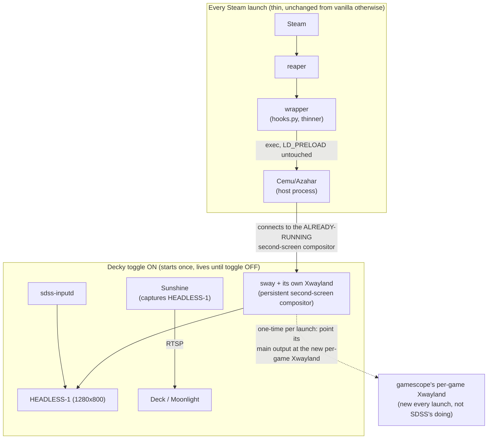

# SDSS — redesign plan

Companion to [docs/architecture.md](architecture.md), which lays out the current shape and
the hardware evidence for why it destabilizes Steam. This document proposes what to change.

> **Status update, 2026-08-19**: Phase 0 is implemented and validated on hardware — see
> [Phase 0's result](#phase-0--immediate-low-risk-hardening-do-this-regardless-of-phase-12-outcome)
> below. A 5-cycle alternating Cemu/Azahar acceptance test, covering the exact adjacent-pair
> transitions that reliably crashed Steam before, completed with zero crashes and flat memory.
> Phase 1/2 (the persistent compositor) are downgraded from "likely required to stop the
> crash" to "a separate, lower-priority improvement toward goal 3" — see
> [Reassessing Phase 1/2 after Phase 0's result](#reassessing-phase-12-after-phase-0s-result).

## The goal, verbatim

Three requirements, stated by the project owner, are the fixed target for this redesign —
everything below is judged against them, not against "does the crash stop happening today":

1. Seamless toggle between SDSS mode and non-SDSS mode via the Decky plugin.
2. In SDSS mode, launching any ROM shows the second screen on the Deck with touch and
   gamepad controls.
3. Outside of the second-screen behavior, the experience must be identical to running
   without SDSS at all.

Goal 3 is the one the current architecture violates hardest, per
[docs/architecture.md §2.1](architecture.md#21-what-sdss-adds-enumerated): eleven processes
spun up and torn down, signal-killed, on every single launch. It's also — per the evidence
in that document — the most likely source of the recurring Steam crash. Fixing goal 3
and fixing the crash point at the same change.

## Design principle

> Move everything that doesn't have to happen per-launch out of the per-launch path.

Concretely: the compositor, Sunshine, and the touch bridge do not need to be created and
destroyed for every game. They need to exist for exactly as long as SDSS mode is toggled
on — which is a Decky plugin action, already the seam goal 1 names. Only the emulator itself
needs to start and stop per launch, exactly like it does without SDSS.

This isn't a new mechanism invented for this document — it's the same seam the config
journal already uses successfully
([docs/architecture.md §2.3](architecture.md#23-whats-already-scoped-correctly-the-config-journal)).
Config patches moved from "every session" to "the Decky toggle" earlier in this project and
that fixed a real class of bugs (drift across long-running SDSS sessions, restores firing on
every Exit Game). The process lifecycle needs the same move.

## Target architecture

The per-launch wrapper's job shrinks to: confirm the persistent service is up, tell it which
profile is launching (so it applies the right window-routing rules), and exec the real
emulator command essentially unchanged. No `podman run`, no fresh container, no fresh sway
process, no fresh Xwayland, no cgroup-parent nesting *per launch*. Those still exist, but
they're set up once per Decky toggle, not once per game.

### Why this targets the crash directly

[docs/architecture.md §3.4](architecture.md#34-leading-hypothesis-evidence-backed-not-proven)
identifies the strongest correlate found on hardware: Steam's overlay/session bookkeeping
staying healthy for exactly one compositor "generation" per Steam boot, and breaking when
that generation is torn down (mostly by signal) and a fresh one takes its place for the next
launch. A persistent compositor has, at most, **one** generation for the entire time SDSS is
toggled on — spanning any number of game launches — which is exactly the condition under
which every documented incident *didn't* happen. This is offered as a strong, evidence-aligned
bet, not a proven fix; §4 below defines how to prove it on hardware before relying on it.

## The central open question

Gamescope dismisses a launched game's loading spinner by walking **Steam's own per-launch
cgroup scope** for a client with a mapped window
([`own_cgroup()`](/Users/timo/Projects/SDSS/host/src/sdss/runtime.py:408), verified on
hardware). The X11 client gamescope is actually watching is **sway itself** — sway is what
connects to gamescope's per-game Xwayland as an X11 client
([`environment()`](/Users/timo/Projects/SDSS/host/src/sdss/compositor.py:146)); the emulator
never touches that display directly. If sway becomes long-lived and stops being recreated
inside each launch's own cgroup scope, does the spinner still dismiss?

This has to be answered on hardware before committing to the persistent-compositor design,
because getting it wrong silently reintroduces the exact spinner-hang bug that was already
found and fixed once this project. Two candidate answers, both requiring a hardware spike
(§4, Phase 1) rather than a guess:

- **Option A — move the process, not the display connection.** A running process's cgroup
  membership can change at runtime (write its PID into a new `cgroup.procs`). If sway (kept
  alive across launches) is moved into each new launch's Steam-assigned scope at the moment
  a new game starts, and wlroots' X11 backend can be told to reconnect its main output to a
  *new* `DISPLAY` value without restarting the process, this preserves the spinner mechanism
  exactly while keeping the compositor persistent. **Unverified**: whether wlroots' X11
  backend supports live output reconnection to a different X11 display at all — this may
  require sway/wlroots source inspection or an upstream feature that doesn't exist.
- **Option B — a thin per-launch relay, persistent compositor behind it.** Keep a
  lightweight, per-launch-scoped process whose only job is to be the X11 client gamescope's
  spinner check sees (satisfying the cgroup-walk requirement cheaply), while the actual
  compositor content is produced by the persistent sway and mirrored/relayed to it. More
  moving parts than Option A, but doesn't depend on wlroots supporting live reconnection.
  **Unverified**: what relay mechanism (if any) can forward composited output between two
  Wayland/X11 servers with acceptable latency for a game's primary display.

If hardware testing shows neither is feasible without disproportionate complexity, the
fallback is Phase 0 below — it does not depend on resolving this question and is worth doing
regardless of which way this resolves.

## Phased plan

### Phase 0 — immediate, low-risk hardening (do this regardless of Phase 1/2 outcome)

**Status: implemented and validated on hardware, 2026-08-19.**

1. **Graceful teardown before force — done.** [`remove_container()`](/Users/timo/Projects/SDSS/host/src/sdss/runtime.py:168)
   now sends `podman kill --signal TERM` to the container and waits on `podman wait
   --condition stopped` (bounded to `GRACEFUL_STOP_TIMEOUT = 3.0` seconds) before falling
   through to the original unconditional `--signal KILL` + `rm --force` backstop, which is
   unchanged and still guarantees teardown even if the graceful attempt times out. Verified
   directly on hardware first, in isolation, before writing any code: `podman kill --signal
   TERM sdss-compositor` against a live session let sway and conmon exit cleanly within 1–3
   seconds with no hang and nothing left behind — disproving the assumption (never actually
   tested before) that only an immediate SIGKILL was reliable here. Across the 5-cycle
   acceptance test below, every teardown completed in ~2 seconds.
2. **Explicit settle/drain window — done, subsumed by #1.** A separate artificial delay
   turned out to be unnecessary: `podman wait --condition stopped` only returns once the
   container's process has actually exited, which is a genuine settle signal (not a guessed
   timer) already. No additional polling was added.
3. **Drop `--ipc=host` — done.** Removed from
   [`compositor_command()`](/Users/timo/Projects/SDSS/host/src/sdss/runtime.py:459), with a
   regression test (`test_container_does_not_share_the_host_ipc_namespace`) locking in its
   absence. Verified on hardware across 5 diverse sessions (Cemu on two different ROMs,
   Azahar on two different ROMs) — Cemu and Azahar both rendered normally, the second screen
   streamed, and nothing regressed. No replacement flag was needed.
4. **Re-run the exact alternating-cycle test — done, passed cleanly.** Ran 5 real
   Steam-launched sessions in sequence: Cemu (Wind Waker HD) → Azahar (A Link Between Worlds)
   → Cemu (Twilight Princess HD) → Azahar (Animal Crossing New Leaf) → Cemu (Wind Waker HD
   again) — covering the Cemu→Azahar and Azahar→Cemu adjacent-pair transitions twice each,
   the exact pattern documented in
   [docs/architecture.md §3.3](architecture.md#33-fresh-reproduction-2026-08-19-it-is-not-about-which-emulator-or-whether-its-overlay-is-even-enabled)
   as reliably fatal before. Each session was observed live for 60–90+ seconds, exceeding
   every historically-recorded crash window (45–90 seconds). Result: Steam's PID
   (`102424`) never changed across all 5 cycles, its RSS stayed flat (~238–241 MB, no linear
   growth) throughout, and every teardown left zero podman containers, zero orphaned
   processes, and zero stale `app-steam-app*.scope` units. The "first launch clean, second
   fatal" correlation did **not** reproduce.

   One separate, non-blocking finding from this run: Azahar does not exit on `SIGTERM` (it
   was sent twice, 3 seconds apart, and ignored both times; `SIGKILL` was required to
   unblock the session). Real usage is unaffected — Azahar is exited via its own in-emulator
   Select+Start hotkey, not an external signal — but it does mean
   [`_terminate_process`](/Users/timo/Projects/SDSS/host/src/sdss/session.py:168)'s
   SIGTERM-then-5s-wait-then-SIGKILL sequence always falls through to the SIGKILL branch for
   Azahar specifically, adding a predictable ~5 second delay to its teardown. Not addressed
   here; noted for a future look if Azahar's teardown latency becomes a user-visible problem.

### Reassessing Phase 1/2 after Phase 0's result

Phase 0 was written as a no-regrets hardening step to do "regardless of Phase 1/2 outcome" —
it was not expected to be sufficient on its own, given how many prior targeted fixes had each
worked around one proximate cause without stopping the recurring abort. It turned out to
resolve the reproduction directly: the graceful-teardown change gives sway's X11 connection to
gamescope's per-game Xwayland an actual chance to close cleanly (a real protocol disconnect
Steam's side can observe) instead of being severed by SIGKILL every time, which is exactly the
mechanism [§3.4's hypothesis](architecture.md#34-leading-hypothesis-evidence-backed-not-proven)
pointed at.

This changes the priority of Phases 1–3, but does not delete them:

- The persistent-compositor redesign (Phases 1–2) is no longer believed necessary *to stop
  the crash*. It remains a real improvement toward **goal 3** on its own merits — the
  per-launch process count in
  [docs/architecture.md §2.1](architecture.md#21-what-sdss-adds-enumerated) is still eleven
  entries recreated every launch, which is still far from "identical outside the second
  screen" even with the crash gone. Treat Phases 1–3 as a goal-3-driven architectural
  improvement to pursue when there's room for it, not as an urgent fix.
- Given Phase 0 alone closed every reproduction attempted so far, do not treat this as
  absolute proof the mechanism can never recur under a condition not yet tested (a longer
  play session, a different emulator combination, a slower/loaded machine). Keep the
  hardware evidence-gathering discipline from this document (live monitor, real Steam
  launches, exact reproduction steps) as the standing method for any future report, rather
  than assuming Phase 0 makes this section purely historical.

### Phase 1 — feasibility spike for the persistent compositor

Answer the open question in isolation, without touching the shipped session lifecycle:

1. Spike sway/wlroots' ability to reconnect a running compositor's X11 output to a different
   `DISPLAY` at runtime (Option A). Check upstream wlroots issues/source before assuming;
   this is a fact to discover, not a design decision to make blind.
2. In parallel or as a fallback, spike whether moving a running process's cgroup membership
   at runtime actually satisfies gamescope's spinner-dismissal walk (independent of the
   output-reconnection question — this part can be tested today with a synthetic process).
3. If both fail, evaluate Option B's relay approach for latency/complexity before ruling out
   the persistent-compositor direction entirely; if that also fails, stop here — Phase 0
   remains the shipped mitigation, and this document's "necessary vs incidental" framing
   still stands as the record of what SDSS *should* look like if a future spike succeeds.

### Phase 2 — build the persistent second-screen service (contingent on Phase 1)

1. A long-lived service (systemd `--user` unit is the natural fit, matching how
   `sdss-memory-monitor.service` was already run as a transient unit successfully during this
   investigation) owns sway, Sunshine, and `sdss-inputd` for the entire time SDSS is enabled.
2. `sdss enable`/`disable` (already the Decky-driven seam, per
   [`cmd_enable`](/Users/timo/Projects/SDSS/host/src/sdss/cli.py:182)) starts/stops this
   service in addition to its existing config-journal and wrapper-reconciliation work. This
   is an additive change to an already-correct seam, not a new one — goal 1 is satisfied by
   construction.
3. Decide what the second screen shows when SDSS is on but no emulator is running (idle
   state) — a blank output, a static "waiting for a game" scene, or the last frame. Needs a
   product decision, not just an engineering one.
4. The per-launch wrapper (`hooks.py`-generated script → `sdss run`) shrinks to: confirm the
   service is healthy (a socket/health probe, not "assume it's there"), apply the Option
   A/B mechanism from Phase 1 to attach this launch's game to the persistent compositor, and
   exec the emulator. If the service is unexpectedly down, decide whether to start it
   on-demand (slower, but self-healing) or fail loudly rather than silently launching without
   a second screen.
5. Window-routing rules are already profile-specific data
   ([profiles.py](/Users/timo/Projects/SDSS/host/src/sdss/profiles.py:116)); with a
   persistent sway, these become a `swaymsg`-driven reload against the running compositor
   instead of baked into a config file at process start. Confirm sway supports reloading
   `for_window`/`assign` criteria without restarting (it does, via `swaymsg reload`) so this
   is a config regen + reload, not new infrastructure.

### Phase 3 — shrink the wrapper further

Once Phase 2 is live, re-examine every remaining per-launch deviation from vanilla against
goal 3:
- `DISABLE_GAMESCOPE_WSI=1` and the `LD_PRELOAD` save/restore dance around the emulator
  ([launch.py](/Users/timo/Projects/SDSS/host/src/sdss/launch.py)) still apply per-launch
  and should stay — they're targeted, verified fixes for the emulator's *own* process, not
  architectural overhead.
- The AppImage shadow-wrapper mechanism ([hooks.py](/Users/timo/Projects/SDSS/host/src/sdss/hooks.py))
  stays; it's how goal 1's "seamless" requirement is met for a normal Steam Library launch,
  and it's already minimal — one exec hop, no polling, no state left behind when SDSS is off.
- Re-audit `_start_emulator`'s environment build for anything that's a leftover assumption
  from the per-launch-compositor world (e.g. `WAYLAND_DISPLAY`/`DISPLAY` values computed
  fresh each session) and adjust it to address the persistent service instead.

## What does not change

- The config-patch journal ([managed_config.py](/Users/timo/Projects/SDSS/host/src/sdss/managed_config.py),
  [patch.py](/Users/timo/Projects/SDSS/host/src/sdss/patch.py)) is already scoped to the
  Decky toggle, not the game session. Nothing in this plan touches it.
  [docs/architecture.md §2.3](architecture.md#23-whats-already-scoped-correctly-the-config-journal)
  documents why it's already correct.
- Profile data staying data-only ([profiles.py](/Users/timo/Projects/SDSS/host/src/sdss/profiles.py))
  — the persistent compositor's window-routing reload in Phase 2 still reads from the same
  `Profile` dataclasses; only *how* the config reaches sway (reload vs. process start)
  changes.
- Touch routing ([`sdss-inputd`](/Users/timo/Projects/SDSS/runtime/inputd/sdss_inputd.py))
  keeps its job unchanged — it moves from "restarted per launch" to "long-lived," but its
  `EVIOCGRAB`/rescale/inject logic is unaffected.
- The read-only rootfs / `$HOME`-only constraint, and every other invariant in
  [docs/PLAN.md](PLAN.md), still hold.

## Acceptance criteria, tied back to the three goals

1. **Seamless toggle**: already true today for the config/wrapper layer (`sdss
   enable`/`disable` reconciles both under one lock); would extend to starting/stopping the
   persistent service too if Phase 2 is built. Not blocked on anything in this plan.
2. **Second screen on any ROM launch, and Steam stays stable doing it**: validated on
   hardware for the current (Phase-0-hardened) architecture — the 5-cycle alternating test
   above reproduced no crash and no leak. This criterion is met today, without Phase 1/2.
3. **Identical outside the second screen**: **not yet met** — this is the remaining gap.
   Measured against [docs/architecture.md §2.1](architecture.md#21-what-sdss-adds-enumerated)'s
   table, the per-launch process count is still eleven entries recreated every launch; Phase
   0 fixed *how* they're torn down, not *how often*. Phases 1–3 are what would close this
   specific gap, and remain worth pursuing on that basis — just no longer as crash fixes.

Both architecture.md's evidence and this plan's phasing should be revisited whenever new
hardware evidence appears (a crash reproduction under conditions not yet tested, a Phase 1
spike result, or further goal-3 work) — this is a living pair of documents, not a
one-time write-up.
